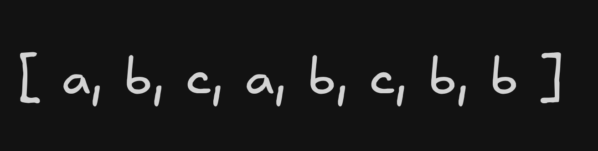
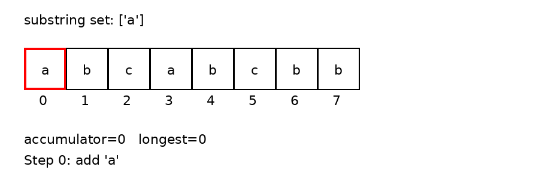
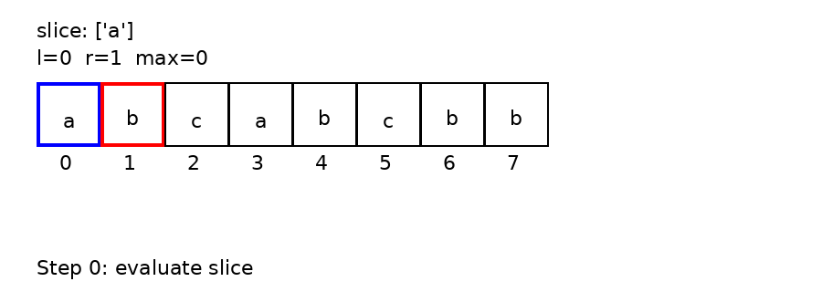

Given a string s, find the length of the longest substring without duplicate characters.

Example 1:

> Input: s = "abcabcbb"
>
> Output: 3
>
> Explanation: The answer is "abc", with the length of 3. Note that "bca" and "cab" are also correct answers.

Example 2:

> Input: s = "bbbbb"
>
> Output: 1
>
> Explanation: The answer is "b", with the length of 1.

Example 3:

> Input: s = "pwwkew"
>
> Output: 3
>
> Explanation: The answer is "wke", with the length of 3.
>
> Notice that the answer must be a substring, "pwke" is a subsequence and not a substring.

Constraints:

- `0 <= s.length <= 5 * 104`
- `s` consists of English letters, digits, symbols and spaces.

[//]: # ""

# `O(n^2) Solution`

Iterate over each element and start traversing the remainder of the string after it.
As soon as you find a duplicate, stop searching with the current start index, reassign
the `longest` tracking var if required, and increment the starter index (j).
it. Keep track of the longest substring.



```typescript
const lengthOfLongestSubstring = (s: string): number => {
  let substring = new Set();

  let longest = 0;
  let accumulator = 0;
  let j = 0;
  let i = 0;
  while (i < s.length) {
    const l = substring.size;
    const char = s[i];

    substring.add(char);

    if (substring.size === l) {
      longest = longest > accumulator ? longest : accumulator;
      accumulator = 0;
      i = j + 1;
      j++;
      substring = new Set();
      continue;
    } else {
      accumulator++;
    }

    i++;
  }

  longest = longest > accumulator ? longest : accumulator;

  return longest;
};
```

# Optimal Solution

Start two pointers, both at index zero. Take an inclusive substring between
the two indexes; if the length of the substring is the same length of a unique
set of the substring's elements, assign over `max` with the current substring
length if longer. Move the right pointer over. If the length of the substring
is not the same length as the set of the substring elements, we have a duplicate;
move the left iterator to the right. Continue this process until the right
iterator is greater than the length of the array.



```typescript
export const lengthOfLongestSubstring = (s: string) => {
  if (s.length === 1) return 1;

  let array = s.split("");
  let max = 0;

  let l = 0;
  let r = 1;

  while (r <= array.length) {
    const slice = array.slice(l, r);

    if (slice.length === new Set(slice).size) {
      max = Math.max(max, slice.length);
      r++;
    } else {
      l++;
    }
  }

  return max;
};
```
